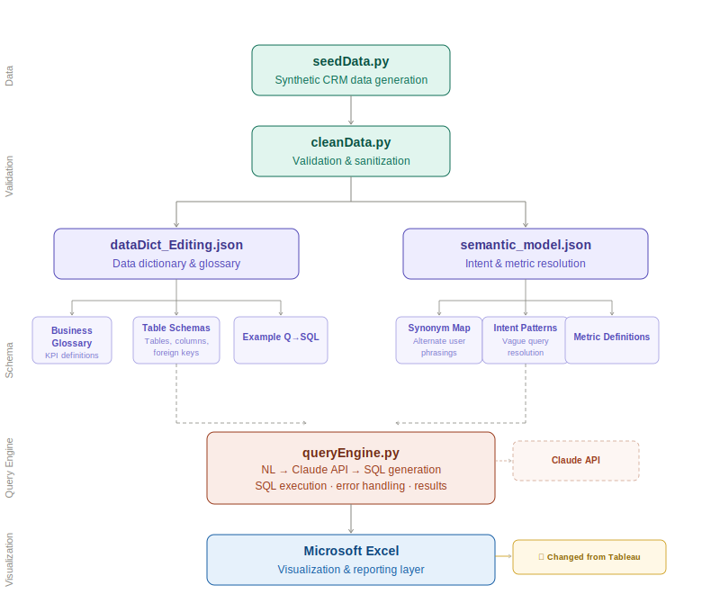

# Insurance CRM Query Engine

A natural language query engine for commercial insurance CRM data, built on Claude AI. Business users — underwriters, brokers, account managers — can ask plain-English questions and receive SQL-generated answers without writing a single line of code.

---

## What It Does

  Answering a question like *"which carriers have the highest decline rates for General Liability?"* typically requires a data analyst, a SQL query, and a wait. This project removes that dependency.

```
  Your question: Which accounts have the worst loss ratios?

  Generated SQL:
    SELECT a.account_name,
           ROUND(100.0 * SUM(l.incurred_amount) / NULLIF(SUM(p.bound_premium), 0), 2) AS loss_ratio_pct
    FROM losses l
    JOIN policies p ON l.policy_id = p.policy_id
    JOIN submissions s ON p.control_number = s.control_number
    JOIN accounts a ON s.account_id = a.account_id
    GROUP BY a.account_name
    ORDER BY loss_ratio_pct DESC
    LIMIT 20

  Results:
    account_name                    loss_ratio_pct
    ──────────────────────────────  ──────────────
    Mcfarland And Sons              312.45
    Bauer-Jacobs                    289.12
    ...
```

The engine also supports **multi-turn conversation** — follow-up questions carry context from the previous exchange, so you can drill down naturally.

---

## Architecture



The pipeline runs in five stages:

**1. Data layer** — `seedData.py` generates a synthetic commercial insurance dataset using weighted probability distributions that reflect realistic pipeline dynamics: IMS status frequencies, carrier decline rates, LOB-to-division mappings, and tiered account segmentation.

**2. Validation layer** — `cleanData.py` sanitizes the raw data: standardizing casing, stripping whitespace, and handling nulls before any queries run.

**3. Schema layer** — `dataDict_Editing.json` is a machine-readable data dictionary that serves as the LLM's schema context. It contains three layers: a business glossary (hit ratio, loss ratio, carrier appetite, etc.), full table schemas with column descriptions, and example question → SQL pairs that anchor the model's output style.

**4. Query engine** — `queryEngine.py` translates plain-English questions into valid SQLite SQL using the Claude API. The system prompt injects all three dictionary layers. Conversation history is maintained across turns for follow-up support.

**5. Visualization layer** *(planned)* — Tableau integration is the intended downstream output for dashboarding and executive reporting. Not yet implemented.

---

## Database Schema

Eight normalized tables covering the full submission lifecycle:

| Table | Description |
|---|---|
| `accounts` | Insured clients with revenue-based tier segmentation |
| `brokers` | Internal producers managing client relationships |
| `carriers` | Insurance companies; each with an assigned underwriter |
| `lines_of_business` | Coverage types (GL, Property, Cyber, Workers Comp, etc.) |
| `submission_groups` | A marketing effort grouping all LOBs for one account |
| `submissions` | One row per LOB per group; tracks the full IMS pipeline status |
| `quotes` | Individual carrier responses to a submission |
| `policies` | Bound coverage contracts with premium |
| `losses` | Claims filed against active policies |

---

## Example Questions

The engine handles both simple lookups and multi-table aggregations:

- *What is our overall hit ratio?*
- *Which carriers have the highest decline rates?*
- *What is our total bound premium by line of business?*
- *Which accounts have the worst loss ratios?*
- *Assess carrier appetite for General Liability submissions*
- *What submissions are currently in underwriting review?*
- *What is the hit ratio by division?*

---

## Setup

**Prerequisites:** Python 3.9+, an Anthropic API key.

```bash
# 1. Install dependencies
pip install anthropic python-dotenv faker

# 2. Set your API key
#    Create a .env file in the project root:
echo "ANTHROPIC_API_KEY=your_key_here" > .env

# 3. Generate the database
python seedData.py
python cleanData.py

# 4. Run the query engine
python queryEngine.py                          # interactive mode
python queryEngine.py --demo                   # run preset demo questions
python queryEngine.py -q "Your question here"  # single question
```

---

## Project Status

| Component | Status |
|---|---|
| Synthetic data generation | ✅ Complete |
| Data validation / cleaning | ✅ Complete |
| Data dictionary | ✅ Complete |
| NL-to-SQL query engine | ✅ Complete |
| Tableau visualization layer | 🔲 Planned |

---

## Tech Stack

- **Python** — data pipeline and query engine
- **SQLite** — prototype database (target: SQL Server)
- **Claude API** (`claude-sonnet-4-6`) — NL-to-SQL translation
- **Faker** — synthetic data generation
- **Tableau** — planned visualization layer
